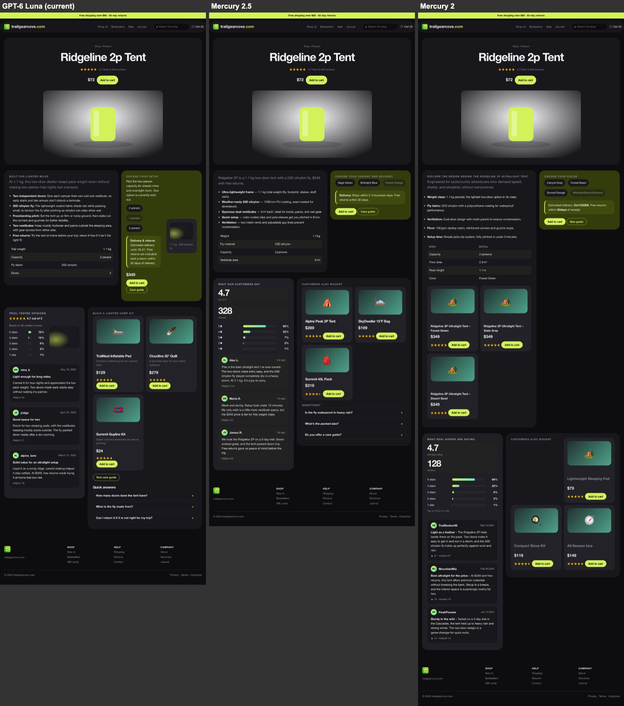
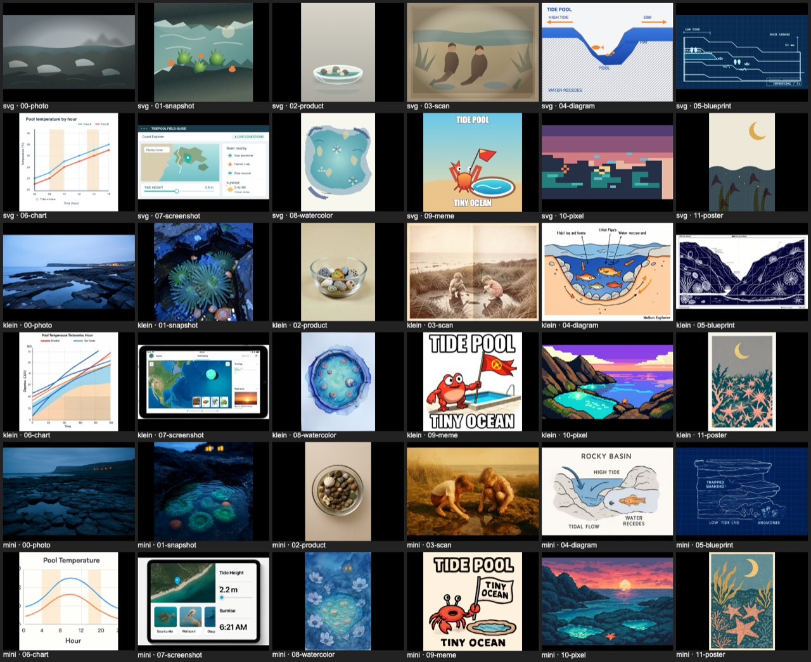
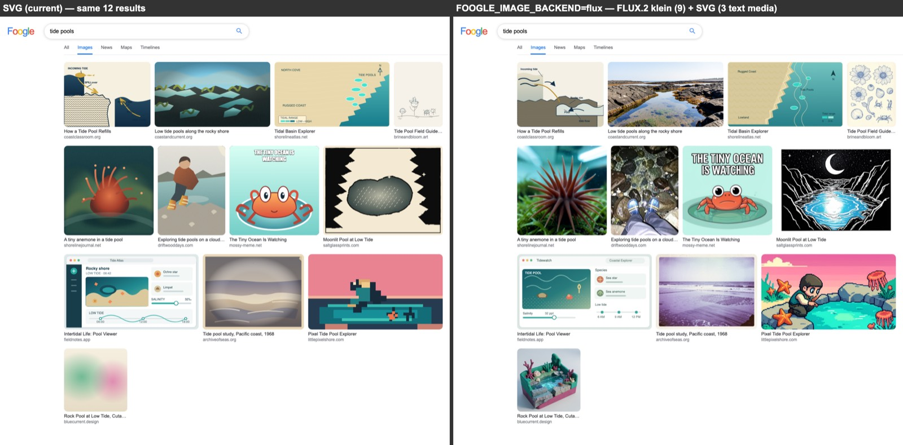

# Foogle model experiments — 2026-09-22

> Since these runs Foogle has been reduced to the winners — GPT-6 Luna, Jev layouts and SVG pictures. The presets, the `single`/`planned` page modes, local providers, other image modes and the benchmark script were removed; they are in git history (`7e5c8f6`).

GPT-6 Luna + Jev is the strongest price/speed candidate in this small screening run. It completed the test page in 5.25 seconds with a $0.0006169 OpenRouter charge. Gemini + Jev was similarly fast (5.46 seconds), at $0.00446025. Free Laguna produced a useful complete page but its search request was rate-limited. The launcher now defaults to Luna + Jev.

## What was built

- Provider presets for MiMo Flash/Pro, DeepSeek Flash, Gemini Flash, GPT-6 Luna and four free endpoints.
- Full-page, text-planned and Jev-planned page modes.
- Isolated model capability fallbacks, usage/latency capture, truncation detection, and rejection of invalid generated sections before caching.
- Repeatable benchmark scripts with raw HTML/text and JSON reports in `.foogle-bench/`.
- Automated tests covering provider fallback isolation, streaming usage, ordering, invalid fragments, Jev failures and the default Luna search-to-page flow.

## Page results

One fixed fictional greenhouse-repair prompt per model/mode. “First content” is server emission of styled HTML with visible content, not browser paint. In templated modes it includes the header before generated sections arrive. Costs below are provider-reported OpenRouter charges and exclude Jev.

| Preset | Mode | First content | Total | OpenRouter cost | Outcome |
|---|---|---:|---:|---:|---|
| mimo-flash | single | 52.21s | 92.96s | $0.0018385 | Model hit the output token limit |
| mimo-flash | jev | 0.55s | 28.36s | $0.0005838 | Complete; basic checks passed |
| mimo-pro | single | 52.78s | 144.63s | $0.0049096 | Complete; basic checks passed |
| mimo-pro | jev | 0.54s | 21.85s | $0.0017078 | Complete; basic checks passed |
| deepseek | single | 23.06s | 64.61s | $0.0017536 | Complete; basic checks passed |
| deepseek | jev | 0.49s | 32.01s | $0.0006495 | Complete; basic checks passed |
| gemini | single | 19.49s | 34.67s | $0.0145627 | Complete; basic checks passed |
| gemini | jev | 0.33s | 5.46s | $0.0044603 | Complete; basic checks passed |
| free-qwen | single | — | 0.73s | unknown | 429 Provider returned error |
| free-qwen | jev | 0.33s | 1.17s | unknown | 429 Provider returned error |
| free-laguna | single | 14.20s | 25.71s | $0.0000000 | Complete; basic checks passed |
| free-laguna | jev | 0.38s | 12.68s | $0.0000000 | Complete; basic checks passed |
| free-nemotron | single | 183.24s | 192.82s | $0.0000000 | Complete; basic checks passed |
| free-nemotron | jev | 0.36s | 84.79s | $0.0000000 | Section generation returned incomplete or invalid HTML |
| free-gemma | single | — | 0.69s | unknown | 429 Provider returned error |
| free-gemma | jev | 0.35s | 1.18s | unknown | 429 Provider returned error |
| gemini | planned | 2.59s | 87.02s | $0.0035467 | Section generation returned incomplete or invalid HTML |
| luna | single | 11.66s | 21.18s | $0.0017335 | Complete; basic checks passed |
| luna | planned | 2.23s | 5.87s | $0.0006982 | Complete; basic checks passed |
| luna | jev | 0.28s | 5.25s | $0.0006169 | Complete; basic checks passed |

## What Jev contributed

Luna is the useful control: full generation took 21.18s; a text-model planner plus templates took 5.87s; Jev plus the same template/parallel-section pipeline took 5.25s. The largest gain comes from reusing CSS and splitting content into bounded parallel calls. Jev reduced the planner-to-header delay from 2.23s to 0.28s in this run. This does not establish a statistically reliable 0.62s completion-time advantage.

The Gemini text-planner control emitted its shell in 2.59s but ultimately failed section validation after 87.02s. It is not a successful completion-time baseline. Some concurrent sections can differ in invented details; a shared outline or source facts would improve consistency.

Browser review of the Gemini full and hybrid outputs showed the expected tradeoff: full generation had a more bespoke article/sidebar design; the hybrid produced a simpler, readable shared layout. Luna passed structural checks; its new output was not visually reviewed because browser control became unavailable.

## Search results

| Preset | First valid result | Complete | Valid results | Outcome |
|---|---:|---:|---:|---|
| mimo-flash | 16.62s | 33.50s | 9 | OK |
| mimo-pro | 17.78s | 103.46s | 8 | OK |
| deepseek | 7.63s | 87.35s | 9 | OK |
| gemini | 2.27s | 9.39s | 9 | OK |
| free-qwen | — | 0.78s | 0 | 429 Provider returned error |
| free-laguna | — | 0.80s | 0 | 429 Provider returned error |
| free-nemotron | 4.59s | 31.86s | 9 | OK |
| free-gemma | — | 0.93s | 0 | 429 Provider returned error |
| gemini | 3.49s | 9.82s | 9 | OK |
| luna | 1.71s | 7.66s | 9 | OK |

Qwen and Gemma free trials returned 429s. A separate Gemma diagnostic identified an upstream shared-provider-pool rate limit, not insufficient OpenRouter credits. A tiny Gemma greeting succeeded, illustrating the variability. Free Nemotron completed full HTML slowly and its hybrid run returned an invalid section. These observations do not prove those endpoints are generally unusable.

## Reproduce and inspect

```sh
npm start -- --preset luna --mode jev --port 3010 --jev-env /path/to/jev/.env
npm run bench -- --presets luna --modes single,planned,jev --jev-env /path/to/jev/.env
npm test
```

- Primary results: `.foogle-bench/initial-comparison/report.json`
- Luna: `.foogle-bench/luna/report.json`
- Planner control: `.foogle-bench/planner-control/report.json`

## Measurement limits

One prompt and one run per model/mode; models were not sampled in randomized order. Some model suites ran concurrently (at most three); sections ran concurrently within a page. The first serial suite was interrupted during an in-flight MiMo Pro request and resumed without repeating recorded trials. Any charge for that interrupted request is outside the recorded cost totals. Provider load, routing, caches and mandatory reasoning can affect these numbers. Image generation and browser paint time are excluded. Structural checks do not measure aesthetic quality or factual correctness.

Fixed benchmark controls: 6,000 full-page output tokens, 1,200 per section, three sections; temperature requested at 1 for results and 0.7 for pages. Providers may ignore unsupported sampling controls. Reasoning is requested off with compatibility fallbacks; Gemini required low reasoning. This compares usable endpoint behavior, not identical internal computation.

## Images: ASCII vs colored ASCII vs pixel art vs SVG

Same six prompts (a hero, four subjects, the Maps-tab map) through GPT-6 Luna, one call per image. Script and galleries: `.foogle-bench/image-lab/`.

| Technique | Median | Output tokens | $/image | Result |
|---|---:|---:|---:|---|
| ASCII (old default) | 3.2s | ~240 | $0.00013 | Subjects often unreadable |
| ASCII, colored by glyph density | 3.2s | same | same | Barely helps; the drawing is the weak part |
| ASCII + inline color tags / color mask | 4.5s | — | — | Slightly nicer, still crude; masks drift out of alignment |
| 32×24 pixel art | 4.0s | — | — | Colorful, but small subjects unreadable; row widths drift |
| SVG, old brief (800×600, 15-40 elements) | 11s | ~1150 | $0.00060 | Best quality |
| SVG, lean brief (400×300, 10-25 elements) | 6.2s | ~660 | $0.00035 | Near-identical quality at half the time |

Hosted presets now draw lean SVGs (`--images ascii` restores the old art). On generated sites the site's `bg`/`fg` go into the prompt, so pictures are drawn in the page's palette and use its background as their backdrop; tested on neon, paper and light palettes. Single-letter `<text>` is allowed so map pins keep their A–F labels.

## Images: one house style → many media

Every picture used to get the same brief ("bold flat-vector, 4-6 colours, at most one gradient, 400x300, no text"), with no colour guidance off-site, so an Images grid came back as twelve 4:3 flat illustrations in the same warm beiges, and every picture on a site was tints of its accent. Now each picture has a **style** (22 media, each with its own SVG technique: gradients and blur for photos, `feTurbulence` grain and paper, `feDisplacementMap` rough edges for woodcuts, collage and watercolour, halftone `<pattern>`s, neon glow, crisp-edged pixel grids, UI chrome, chart axes) and a **shape** (1:1, 4:3, 16:9, 3:4, 2:3). Image search results name both; the grid lays them out in justified rows. A site picks one style from its kind and mood. News thumbnails are mostly photos, with the odd chart, map or scan. Media made of words (memes, charts, screenshots, blueprints, maps, diagrams) may use a few short labels. Photographic media get a light (golden hour, flash, night streetlights…) and flat-colour media a colour scheme, both picked per description, so a page doesn't converge on one palette. Before/after screenshots: `.foogle-bench/shots/`.

All 22 styles of one subject, GPT-6 Luna, 8 concurrent:

| Brief size target | Median | Mean SVG size | Notes |
|---|---:|---:|---|
| old flat brief (≈ `flat` style) | 5.0-6.4s | ~1300 chars | one look |
| 1600 chars | 7.8s | 2163 chars | |
| 1300 chars (shipped) | 7.0s | 1911 chars | text-heavy screenshots and charts are slowest (~8-11s) |

A whole Images page (12 pictures) finishes in about the same time as before; six Images pages at once (72 pictures through the 12 image slots) took 42-48s against 39-43s. Page generation doesn't change: on three fresh sites the styled header arrived after 0.22-0.29s and the page finished in 4.4-6.0s.

Things that broke and are now guarded: a model repeats an attribute (`fill="#333" … fill="none"`), or writes a bare `&` in a label, and the whole SVG renders blank (the sanitizer now dedupes attributes and escapes `&`); a frame drawn as a `<path>` without `fill="none"` blacks out the picture (the brief now says so); displacement filters leave ragged bare edges unless the background stays unfiltered.

## Pages: "Model hit the output token limit"

About 1 page in 16 lost a section to this error, and the visitor got the "collapsed mid-construction" toast. Measured on 47 fresh pages built from 56 real search results for 14 varied queries (every site kind, Jev picking the styles), with each section call's finish reason, usage and raw text recorded:

- Sections are not too long for their budget. By the time they close, sections take p50 ~400 output tokens and at most ~1,050, even with a calculator, quiz, form or tabs in them (interactive p50 ~510, plain p50 ~330), against `max_tokens` 1600. No reasoning tokens are spent (`reasoning: {enabled: false}` holds), and no section drew an inline SVG.
- Every truncated section had already closed. 8 of 188 sections (4%) kept writing after `</section>`: a thousand tokens of blank lines, a `<style>` block, or notes to itself ("But word count 134? fine…") followed by the whole section again. None of that reached the page, but the page waited for it (those sections took 6-13s instead of ~4s), and the 3 that ran to 1600 tokens failed the page.

Now a section is finished at its own closing tag: the page moves on, and the rest of the reply is read in the background only so its cost still reaches the daily budget (`onUsage`), with a token-limit error there ignored. A section that the limit still cuts off before it closes keeps its whole blocks and is closed there. That never happened naturally; with a forced 300-token limit, all 8 truncated sections were kept.

| Same 47 inputs, 4 pages at a time | Token-limit failures | Shell p50 | First section p50 | Page p50 | Page p90 | Page max |
|---|---:|---:|---:|---:|---:|---:|
| before | 3 (6.4%) | 0.22s | 1.01s | 6.7s | 8.7s | 14.3s |
| after | 0 | 0.19s | 1.00s | 6.3s | 7.9s | 10.5s |

In the "after" run, 10 sections ran on and 5 of them reached the limit, which would have failed 5 pages before. Page times are for pages that completed. The runs turned up one unrelated failure: twice in a row, the provider's stream died mid-section ("Stream ended before a terminal response event").

## Search suggestions: which model, and how fast — 2026-09-23

Suggestions under the search boxes (`lib/suggest.js`, `public/suggest.js`) had to feel instant: the target was suggestions for what's typed on screen within ~150ms of a pause, at p50. Measured from a laptop on home broadband; each "list" is one streamed call asking for 10 suggestions (16 for 1-2 characters), at a cost of ~350 tokens in and ~100 out.

**Models.** Ten prefixes ("cn", "how to m", "best ", "weather in", "am", "is it safe to", "mars colony j", "yout", "fl", "reddit "), same prompt, one call each, four models at a time. The times are from sending the request:

| Model (provider) | First token p50 / p90 | First line p50 | 8 lines p50 | All p50 | $ per list | Lines that continue the text |
|---|---:|---:|---:|---:|---:|---:|
| Llama 3.1 8B (Groq) | 143 / 169ms | 164ms | 214ms | 243ms | $0.000016 | 82% (27% on long text) |
| Llama 3.3 70B (Groq) | 180 / 207ms | 202ms | 419ms | 476ms | $0.000176 | 100% (80% on long text) |
| gpt-oss-120b, low reasoning (Cerebras) | 217 / 1616ms | 298ms | 309ms | 314ms | $0.000219 | 99%; one 429 in ten |
| gpt-oss-20b, low reasoning (Groq) | 324 / 523ms | 326ms | 426ms | 454ms | $0.000057 | 100%, but offers the typed text itself as a site ("cn \| cnn.com") |
| Ministral 3B | 353 / 1267ms | 374ms | 699ms | 904ms | $0.000020 | 96% |
| Gemini 3.1 Flash Lite | 561 / 841ms | 561ms | 787ms | 868ms | $0.000143 | 100% |
| GPT-6 Luna, fast tier | 538 / 677ms | 568ms | 817ms | 971ms | $0.000099 | 100% |
| GPT-6 Luna | 591 / 791ms | 641ms | 1022ms | 1224ms | $0.000050 | 100%, the best lists |
| Mercury 2.5 | 620 / 5757ms | 620ms | 620ms | 632ms | $0.000017 | 100%, but copied the prompt's example |
| Llama 3.1 8B (any provider) | 449 / 5757ms | 513ms | 1247ms | 1342ms | $0.000008 | 87% |
| Gemma 4 26B, Qwen 3.7 Flash, Ling 3.0 Flash, DeepSeek V4 Flash | 594–962ms | 773–1280ms | | 992–3169ms | $0.000005–0.000033 | 94–100% |

Only Groq's Llamas get under ~200ms. Jev (TypeSafe) answers in 180-270ms, but it returns typed judgments over options it's given (a choice among candidate completions, say); it can't write suggestions, so it would only add a second hop. Luna writes the best lists but its first token takes ~600ms. The 8B is fastest and cheapest, and fine on short text, but on long text it rewords what was typed ("weather in tokyo tomor" → "tokyo weather today"), leaving one or two usable lines; a second example in the prompt took it from 48% to 60% overall. So short text (under 12 characters) goes to the 8B and longer text to the 70B.

**End to end.** `scripts/suggest-latency.js` types 10 queries per round into the browser's own suggestion engine against a real server: 90-220ms a key (~75 wpm), a pause to read after a third of the words and at the end. "After a pause" is the time from the last key before the pause until suggestions for that text were there to show (a frame of rendering not included); "full list" until the dropdown had 5 rows or everything there was. Cold is the first visitor on a fresh server (which then writes the empty box and the 26 first letters for everyone, $0.0007 once), warm is different queries after that, and repeat the first queries again as a new visitor.

| Setup | Round | After a pause p50 / p90 | Full list p50 / p90 | Answered in the browser | Model calls per query | $ per query |
|---|---|---:|---:|---:|---:|---:|
| **Shipped: 8B under 12 characters, 70B from 12** | cold | **0 / 158ms** | 0 / 236ms | 75% of keys | 10.4 | $0.0014 |
| | warm | **0 / 102ms** | 0 / 233ms | 76% | 9.2 | $0.0009 |
| | repeat | 0 / 1ms | 0 / 1ms | 80% | 1.2 | $0.0002 |
| 8B only | cold | 0 / 63ms | 0 / 284ms | 80% | 11.1 | $0.0002 |
| | warm | 0 / 0ms | 0 / 183ms | 76% | 8.2 | $0.00013 |
| 70B only | cold | 0 / 149ms | 26 / 277ms | 74% | 12.8 | $0.0025 |
| | warm | 0 / 0ms | 0 / 392ms | 80% | 11.0 | $0.0021 |
| Shipped models, waiting up to 150ms for a shorter prefix's list in flight | cold | 0 / 190ms | 3 / 415ms | 66% | 7.9 | $0.0010 |
| 8B only, the same waiting | warm | 0 / 283ms | 0 / 336ms | 67% | 6.8 | $0.00014 |

What makes it fast is not the model so much as the browser: every list it fetches is kept, and the lists of shorter prefixes are filtered for the current text, so three keys in four have suggestions at once (a list for "cnn" answers "cnn " and "cnn l" while "cnn l"'s own list streams in). A request goes out only when those can't fill 5 rows, streams line by line, and is cancelled only if the text is edited so it no longer fits. On the server, lists go into an LRU shared by all visitors, and a request joins a generation already running for the same text. After a pause on a prefix the browser also prefetches the top suggestion's next letter (about one request in ten). Waiting on a list already in flight instead of asking for every key saved a quarter of the calls but made suggestions visibly slower, so it's off (`patience` in `createEngine`). The 70B makes long queries' lists full instead of one or two lines, at ~6 times the cost per query; `SUGGEST_LONG_AT=1000` runs the 8B everywhere.

**Cost and limits.** A typed query costs ~$0.001 of model calls, about a seventh of a search ($0.007), and nothing when someone has typed it before. Each generated list is charged to the visitor as `suggest` ($0.00003) or `suggestLong` ($0.00025) in `lib/limits.js`, so the default $0.10 burst covers ~70 typed queries on top of searching; lists from the cache are free. Over a limit, or over the day's budget, `/api/suggest` answers with no suggestions (429/503 and `Retry-After`) and the browser asks for nothing until then: the box just has no dropdown. A model that fails or takes over 2.5s gives no suggestions either.

## Images: pictures in half the time, painting themselves in

Measured 2026-09-23 on cold Images pages (fresh server, empty image cache) in Chromium at 1280×800, three queries ("tide pools", "vintage typewriters", "mars colony"), before and after, alternating runs.

Where the time went: each picture's result line arrived at 1.3-4s and its generation started then (the server already warmed pictures as lines landed, and at desktop size the browser asked for every picture at once, lazy loading or not). Time to first token was ~0.7s. The rest was writing: a median of ~900 output tokens (charts ~580, pixel art ~670, woodcuts ~650; photos, diagrams, screenshots and posters ~1000) at ~123 tokens/s on OpenAI's endpoint, which is where OpenRouter sent every request. The system prompt is 290-440 tokens, under OpenAI's 1024-token minimum for prompt caching (`cached_tokens` was always 0), and prefill isn't the bottleneck anyway.

| 12 concurrent pictures, same 12 specs | Median picture | Time to first token (p50) | Tokens/s (p50) | $ per 12 |
|---|---:|---:|---:|---:|
| default routing (OpenAI) | 8.0-8.3s | 0.8s | 123 | $0.0054-0.0057 |
| `provider.sort: "throughput"` (Azure) | 4.3-4.6s | 0.9-1.0s | 261-265 | $0.0055 |
| OpenAI "fast" tier | 4.7s (one took 19.8s) | 0.8s | — | double |
| Mercury 2.5 (diffusion model) | 1.6s | 0.7s | ~900 | $0.0018 |

Luna on Azure is the same model at the same price, twice as fast. Over 48 more requests its time to first token was p50 1.1s, p90 3.0s, max 3.4s; OpenAI sorted by latency was p50 5.3s at the time. For the Images result lines (3 shards of 4), throughput routing put the last line at 2.0-2.3s against 3.8-5.5s for the default and 3.0-3.3s sorted by latency. Mercury lost a blind side-by-side of the same 12 pictures 0-12 (and two of its pictures were broken: a runaway pixel-art grid and a solid black woodcut), so pictures stay on Luna. A brief asking to set shared attributes once on a `<g>` didn't shorten anything (median 862-919 tokens against 869-934), and the SVGs are already compact: fewer tokens would mean less picture.

What changed:

- **Routing.** Pictures and the Images result shards ask OpenRouter for the fastest provider (`FAST_ROUTE` in `lib/llm.js`), leaving out OpenAI's flex tier (cheaper, but can queue for many seconds) and fast tier (double the price, no faster).
- **Pictures stream and paint in** (since replaced by a crossfade from the sketch; see the follow-up below). An `` asking for a picture still being drawn gets `multipart/x-mixed-replace`: a sketch of its colours right away, a sanitized draft of the SVG so far (complete tags, open elements closed) up to four times a second, then the picture. Chrome, Firefox and Safari all repaint an `` for each part, as long as the boundary follows each part rather than leading the next (otherwise every part shows one part late). Defs come first (13-43% of the text), then the backdrop, so a real picture starts appearing ~2s after its line.
- **Sketches in the page.** Image, News and Maps results carry the same sketch as a CSS background, so a tile has colour the moment its line lands, even before a browser connection frees up for its picture (plain HTTP/1.1 allows 6 per host; the Render deployment speaks HTTP/2).
- **Queue.** 24 pictures at once instead of 12, and a picture someone is waiting for goes ahead of one for a prefetched page.
- **Repair.** Drafts and finished pictures are rebuilt with balanced tags, so a picture with one mismatched closer (`<path …>SAME ROCK,</text>`, 1 of 205 in these runs) draws instead of rendering blank. The 204 well-formed ones come through byte for byte.

| Cold Images page, 12 pictures (3 queries) | Before | After |
|---|---:|---:|
| First picture on screen | 8.8-9.7s | 1.1-1.3s (sketch), 3.0-3.2s (drawing) |
| First picture finished | 8.8-9.7s | 5.2-5.3s |
| All pictures finished | 13.6-14.1s | 7.9-11.2s |
| Per picture, line to finished: median / p90 | 8.4s / 10.2s | 4.5s / 5.9s |
| Three Images pages at once (36 pictures): all finished / median | 27.5s / 13.4s | 11.7s / 5.2s |
| News page (8 thumbnails): first on screen / all finished | 8.8s / 14.4s | 1.7s sketch, 3.3s drawing / 9.6s |

The cost is unchanged: ~$0.0061 per Images page (12 pictures ~$0.0055, shards ~$0.0006). What's left is the odd slow stream: the 11th of 12 pictures finished at 7.7-8.8s, and one slower picture set the "all finished" time.

### Follow-up: from the sketch straight to the picture

Watching pictures assemble one shape at a time looked unfinished, so the drafts went. `/img` now sends only the finished picture, as a plain SVG with no multipart. Until it arrives, its `` shows the sketch as a CSS background: the Images, News and Maps results as before, and now also the hero art and section pictures of generated sites (`sketchFor` in `lib/images.js`, merged under any style the model gave the ``). The picture then fades in over its sketch in 0.35s. The fade is a CSS animation inside the served SVG (`fadeIn`), because a fade on the `` element would fade its background sketch with it. Chromium, Firefox and WebKit all run it from a first frame at opacity 0, so nothing flashes, and it needs no script: the theme's `onload` handlers went too, and the `/web` CSP's `script-src` is now just `'self'`. Chromium runs an SVG image's animations only while the image is painted, so a picture that finished further down the page fades in as it's scrolled to. `npm run shots` shows finished pictures without the fade.

Measured 2026-09-23 on cold Images pages in Chromium at 1280×800, with the same routing, queue and prompts as above:

| Cold Images page, 12 pictures | This change |
|---|---:|
| First sketch on screen | 1.3-1.6s |
| First picture finished | 5.4-5.9s |
| All pictures finished | 9.7-10.9s |
| Per picture, line to finished: median / p90 (36 pictures) | 4.9s / 6.2s |

Each picture reached the screen within 0.1s of the server finishing it, so sending it whole costs nothing: the time is all drawing. An hour later the providers were slower for everyone, and five alternating pairs of cold pages against the previous code (the multipart stream) drew at the same speed: the median picture took 7.1-9.2s there and 7.6-8.0s here, and neither side was ahead once the order was swapped.

## Diffusion models: text and pictures — 2026-09-23

Do diffusion models help anywhere? Text diffusion LLMs (Inception's Mercury 2 and 2.5, the only ones on OpenRouter) were tried on page sections, result shards, suggestions and site specs, and image models on pictures. Everything went through OpenRouter (there are no fal, Replicate or Together keys), with Foogle's own prompt builders, so every model got exactly the prompts Luna gets. About $0.73 of calls. Nothing was adopted; the FLUX prototype is kept as a patch.

**Text: Mercury against Luna.** Mercury returns a reply in 3-13 big chunks where Luna streams ~400, so a section lands in one or two bursts: pages finish much sooner, but the first words arrive no sooner. It needs `reasoning: {enabled: false}` (Foogle sends it; without it Mercury 2.5 spent all 800 tokens thinking and wrote nothing).

| Use | Model | First output p50 | Done p50 (p90) | $ | Quality and format |
|---|---|---:|---:|---:|---|
| Page sections, 12 pages | Luna | 1.5s | 6.5s (8.3s) | $0.0017/page | 0/48 sections failed; 21/24 pictures asked for; no invented classes |
| | Mercury 2.5 | 1.5s | 2.6s (3.4s) | $0.0005/page | 5/48 failed with an Inception 502 (5 of 12 pages lost a section); 3/19 pictures; invented classes in 5; thinner (93 words p50 against 133), odd facts ("120°F room temp") |
| Page sections, 4 pages | Mercury 2 | 1.3s | 2.4s (2.8s) | $0.0024/page | 0/16 failed; 3/8 pictures; runs long (up to 256 words) and repeats other sections |
| Search shards, 4 queries × 3 | Luna | 1.7s | 4.7s | $0.00065/page | 40/42 lines follow the field rules |
| | Mercury 2.5 | 1.2s | 1.8s | $0.00019/page | one 502 in 12 shards; generic sites, titles that echo the query |
| | Mercury 2 | 1.0s | 1.4s | $0.00087/page | 2/12 shards not one object per line |
| Images shards, 2 queries × 3 | Luna / Mercury 2.5 / 2 | 1.9 / 0.8 / 0.6s | 5.0 / 1.6 / 1.1s | $0.00055 / 0.00018 / 0.00074 | all 24/24 valid; Mercury's captions formulaic ("Sticker design: …") |
| Suggestions, 10 prefixes | Llama 8B / 70B (Groq) / Mercury 2 / 2.5 | 161 / 270 / 613 / 777ms | 305 / 524 / 643 / 827ms | $0.00002 / 0.00024 / 0.00009 / 0.00002 a list | all usable; Mercury 2's the most futuristic |
| Site specs: cnn, reddit, letterboxd | Luna | look 2.3-3.3s | 6.6-13.3s | $0.0006-0.001 | closest to the real brands |
| | Mercury 2.5 / 2 | look 0.6-0.9s | 1.6-2.7s | $0.0003 / 0.001-0.002 | wrong looks (a sports ticker on CNN, Reddit and Letterboxd; Letterboxd light), nav pairs flattened into labels ("/popular"), the CSS line missing on 2 of 3 |

Side by side, Mercury's sections look about as designed as Luna's, but Luna's content is more specific and more consistent:



**Pictures: image models against SVG.** One cold call each, the same photo prompt, at the smallest size accepted:

| Model | Time | $ a picture | Output |
|---|---:|---:|---|
| FLUX.2 klein 4B | 4.9s | $0.014 | 512×384 JPEG, 108KB |
| Gemini 3.1 Flash Lite Image | 3.8s | $0.034 | 1200×896 JPEG (no smaller size), 284KB |
| gpt-image-1-mini, low quality | 9.0s | $0.0023-0.0034 | 1024-1536px PNG, 1-3MB |
| Krea 2 medium turbo, MAI Image 2.6 Flash | 11-12s | $0.015 | ~1MP PNG |
| Recraft V4.1 vector | 9.9s | $0.08 | a posterised 334KB SVG |
| Riverflow 2.5 fast, Seedream 5 lite, Grok Imagine 2.0, Qwen Image 3, Ming Image 0.1 | 25-71s | $0-0.06 | |

Every raster model painted a convincing photo; none was under a second (OpenRouter has no SDXL-Turbo or FLUX schnell class model). Meta Muse needs an 18+ confirmation on the account, and Gemini Diffusion isn't on OpenRouter. The two fastest affordable ones, against SVG, on the same 12 Images results for "tide pools" (12 media, all at once):

| 12 pictures at once | First | p50 | p90 | All | $ for 12 | Size |
|---|---:|---:|---:|---:|---:|---:|
| SVG (Luna, that hour) | 5.2s | 7.8s | 13.2s | 14.5s | $0.0058 | ~2KB |
| FLUX.2 klein 4B | 2.4s | 3.4s | 4.0s | 4.5s | $0.168 | ~110KB JPEG; ~16KB as WebP q70 at 480px |
| gpt-image-1-mini, low quality | 7.6s | 10.1s | 10.4s | 10.7s | $0.037 | ~1.9MB PNG |

klein is far better at photos, snapshots, scans, product shots, watercolour, woodcut, pixel art and posters, and wrote the meme's caption perfectly, but its chart, diagram and blueprint labels are garbled where SVG's are crisp (rows: SVG, klein, gpt-image-1-mini):



In Foogle, with the prototype below and the three text media left as SVGs, a cold Images page painted its 9 other pictures in 2.1-4.0s each. The first picture was on screen at 4.3s (7.6s on an all-SVG page) and all 9 by 9.3s; the SVG screenshot still finished last, at ~16s, as on an all-SVG page:



**Verdicts.**
- Photographic and painterly pictures: adopt as an option, not the default. FLUX.2 klein was faster than SVG and far better at photos, but costs 28 times as much: an Images page goes from ~$0.007 to ~$0.13, and `DAILY_BUDGET_USD=1` pays for ~70 painted pictures a day. Painting only photo, snapshot, product and scan (where SVG is weakest) is a cheaper middle ground.
- Media made of words (chart, diagram, screenshot, blueprint, map): keep SVG.
- The Doodle: keep SVG (not tested). Its scene must leave exact room for the letters, and it is drawn once a day, so speed doesn't matter.
- Page sections: not yet. Mercury 2.5 finishes pages 2.5 times sooner for a third of the price, but its 502s, dropped pictures and thinner content rule it out for now. It may be worth another look on sections 2-4 only, with code placing the pictures.
- Result shards, suggestions and site specs: no. Generic results, slower than Groq, and the wrong brands.

**The prototype** is [`experiments/flux-image-backend.patch`](experiments/flux-image-backend.patch). Apply it with `git apply experiments/flux-image-backend.patch` and start Foogle with `FOOGLE_IMAGE_BACKEND=flux`. Media in `RASTER_STYLES` are then painted by FLUX.2 klein 4B through OpenRouter's `/images` endpoint (512px JPEG). Their cost goes to the daily budget, and any failure falls back to an SVG (a path that ran live when the account ran out of credit). A painted picture is sent as is, since the SVG's fade-in would corrupt a JPEG, and the disk cache is keyed by backend. Fake and replay modes always draw SVGs. Adopting it for real would also take:
1. Charging a painted picture ~$0.014 in `lib/limits.js` (it charges $0.0005), and a bigger daily budget or fewer `RASTER_STYLES`.
2. Serving WebP (~16KB instead of ~110KB), which needs `sharp` or similar.
3. A fade-in for painted pictures, which pop in instead (the fade lives inside the SVG).
4. Keeping real people out. Painted news thumbnails look like real photos of invented events: the prompt should ask for invented people only, and pictures could carry a small "AI" label.
5. A test of the raster path with a stubbed fetch.

**Open questions.**
- OpenRouter charged $0.014 for a 0.2-megapixel picture, which looks like a one-megapixel minimum. BFL's or fal's own API may bill the real size: fal quotes klein at $0.009 a megapixel with sub-second inference (not verified; needs a `FAL_KEY`), which would beat SVG outright.
- Site palettes in the raster prompt (as hex colours) and painted pictures on generated sites weren't checked: the account ran out of credit first.

## Live references

- [OpenRouter model catalog](https://openrouter.ai/api/v1/models) — exact IDs and prices were checked before trials.
- [GPT-6 Luna official documentation](https://developers.openai.com/api/docs/models/gpt-6-luna) — current API ID and supported reasoning controls.
- [TypeSafe HTTP API](https://docs.typesafe.ai/api) and [Choice primitive](https://docs.typesafe.ai/primitives/choice) — typed layout judgments.
